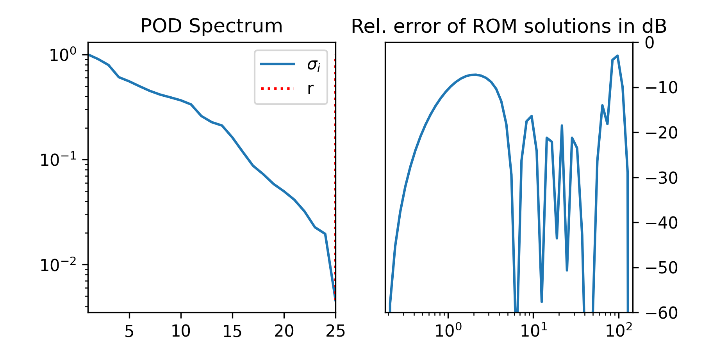

# pymor-bempp

A simple demo showcasing the potential of model order reduction for BEM scattering problems combining [pyMOR](https://github.com/pymor/pymor) and [bempp-cl](https://github.com/bempp/bempp-cl) for the [sphere scattering tutorial](https://nbviewer.org/github/bempp/bempp-cl/blob/main/notebooks/helmholtz/helmholtz_combined_exterior.ipynb).

## Usage

Install the requirements listed in [requirements.txt](requirements.txt) and run either

``` shell
python sphere.py
```

to construct a reduced order model according to the parameters at the top of the script and produce something like



or run

``` shell
python visualize.py
```

to compare the solutions of the full and reduced order models and visualize them as


